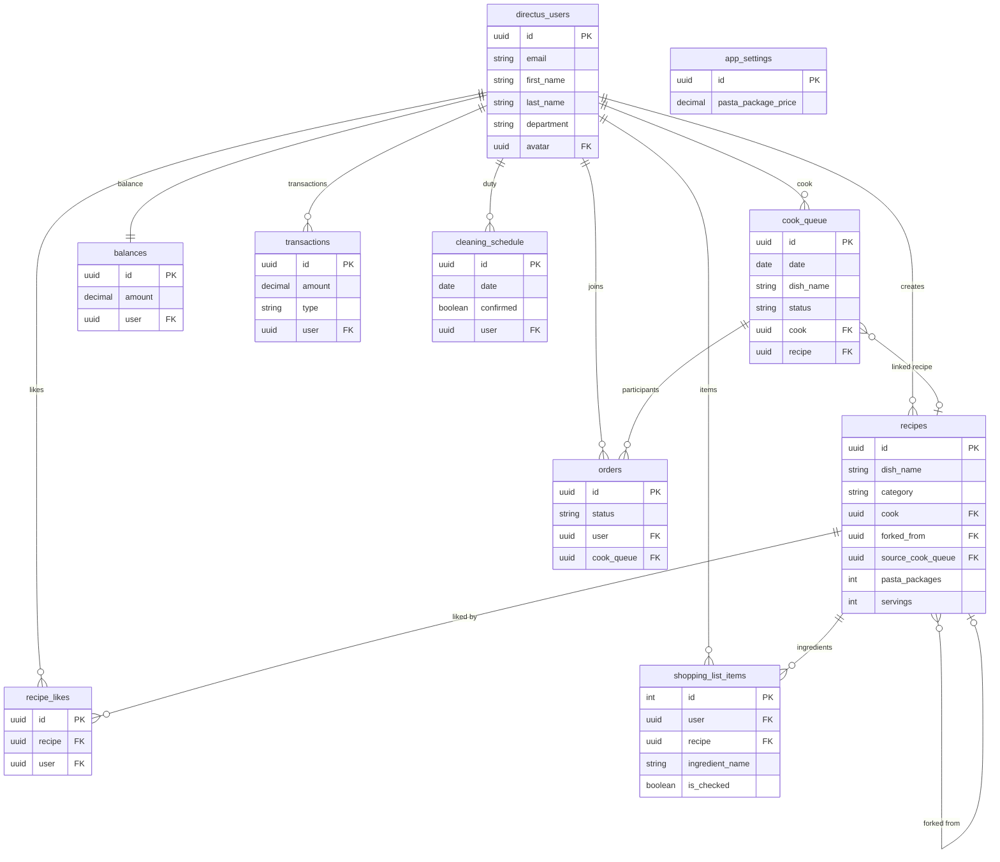

# ItoCook — Architecture

> High-level overview + detailed design decisions.
> Detailed per-feature docs in [architecture/](architecture/).

---

## Tech Stack

| Layer | Technology | Role |
|---|---|---|
| Frontend | Nuxt 4 (Vue 3, TypeScript) | SSR, routing, UI |
| Backend/API | Directus 11 | REST API, RBAC, JWT auth, data layer |
| Database | PostgreSQL 15 | All persistent data |
| Infrastructure | Docker Compose | Orchestration (4 services) |

## Architecture at a Glance

```
 Browser (localhost:3000)
       │
       ├── Nuxt Client (Vue SPA)
       │     └── composables/ → useDirectus (HTTP client)
       │           └── Authorization: Bearer <token>
       │
       ├── Nuxt Server (SSR + API routes)
       │     └── server/api/* — admin-proxy routes
       │           └── getAdminToken() → admin Directus session
       │
       └── Directus (localhost:8055)
             └── PostgreSQL (localhost:5432)
```

## Docker & Networking

### Two Directus addresses

| Who calls | Address | Why |
|---|---|---|
| Browser | `http://localhost:8055` | Browser doesn't know the internal Docker network |
| Nuxt SSR (server-side) | `http://directus:8055` | Requests go inside the Docker network, never reaching the internet |

### How Nuxt resolves the Directus URL

In `docker-compose.yml`:
```
NUXT_PUBLIC_DIRECTUS_URL=http://localhost:8055
```

Nuxt reads it via `useRuntimeConfig()`. Public variables (`NUXT_PUBLIC_*`) are visible in the browser. Private variables are server-only — this is why admin passwords stay server-side.

### Docker network diagram

```
┌─────────────────────────────────────────────────────────┐
│                   Docker Network                         │
│                                                         │
│  ┌──────────────┐     ┌──────────────┐                  │
│  │   postgres   │◄────│   directus   │◄── browser       │
│  │   port 5432  │     │   port 8055  │    localhost:8055│
│  └──────────────┘     └──────────────┘                  │
│                              ▲                          │
│                              │ http://directus:8055      │
│                       ┌──────────────┐                  │
│                       │   frontend   │◄── browser       │
│                       │   port 3000  │    localhost:3000 │
│                       └──────────────┘                  │
│                                                         │
│  ┌──────────────┐                                       │
│  │     api      │  (FastAPI placeholder)                │
│  │   port 8000  │                                       │
│  └──────────────┘                                       │
└─────────────────────────────────────────────────────────┘
```

## Key Architectural Decisions

1. **Directus as API layer, not just CMS** — auto-generates REST endpoints from collection definitions, provides RBAC and JWT auth out of the box. Eliminates thousands of lines of boilerplate CRUD code.

2. **Admin-proxy pattern** — all privileged operations (user creation, deduction confirmation, duty upsert, settings read/write, user list) go through Nuxt server routes that proxy to Directus with an admin Bearer token. Admin credentials never reach the browser.

3. **Cookie-based token storage** — `directus_token` cookie (JS-readable) survives page reloads and works with SSR. Trade-off: `httpOnly: false` required because the client needs to attach the token to cross-origin Directus requests.

4. **No Directus SDK** — custom `useDirectus` composable wrapping native `fetch`. Single point of change for all API communication, error handling, and auth header injection.

5. **State machine in cook panel** — the `/cook` page implements a 6-state machine (`loading → assign → dish → scheduled → cooking → ready → done`). Each state renders a distinct UI section with specific actions.

6. **Fork-on-cook** — when a cook selects another user's recipe, the system creates a copy (fork) owned by the cook. Keeps recipe ownership intact while allowing per-cook modifications.

7. **In-memory caching for admin token** — 23-hour TTL, reset on server restart. Acceptable for single-server deployment.

## Data Flow (Cooking Lifecycle)

```
1. Cook assigned       → cook_queue created (admin or self-assign)
2. Dish named          → PATCH cook_queue { dish_name, category, recipe? }
3. Participants join   → orders created (status: confirmed)
4. Cooking starts      → PATCH cook_queue { status: cooking }
5. Lunch ready         → PATCH cook_queue { status: ready }
6. Receipt entered     → receipt amount + pasta cost
7. Deduction confirmed → POST /api/deduction/confirm (admin-proxy)
     ├── Creates transactions per participant
     ├── Updates balances per participant
     └── Deletes shopping_list_items for this recipe
8. Queue completed     → PATCH cook_queue { status: completed }
```

## Phase 6b: PWA + Push Notifications

Added full PWA support (`@vite-pwa/nuxt` with `generateSW` strategy) and a two-tier notification system (in-app + push). The notification system uses Directus Flows to detect events and create `notifications` records, then calls FastAPI `/send-push` to deliver Web Push notifications via `pywebpush`.

Key additions:
- **`notifications` collection** — stores in-app notification records; User policy can read own and update `read` field only
- **`push_subscriptions` collection** — stores Web Push subscription objects (endpoint + keys); populated by `usePushNotifications` on first login
- **FastAPI `/send-push` endpoint** — authenticates as Directus admin, fetches subscriptions by user ID, sends push via `pywebpush` with VAPID auth
- **8 Directus Flows** — all event and schedule flows create notifications AND push (see `docs/architecture/notifications.md`)
- **Nginx regex fix** — `^(?!/cms/).*\.(js|css...)` to prevent Nuxt SW from intercepting Directus admin JS (MIME type fix)
- **Service Worker** — `sw.js` generated by Workbox, delegates push events to `push-handler.js` for system notification display and click handling

For full details, see [docs/architecture/notifications.md](architecture/notifications.md).

## Collections

| Collection | Purpose | Key Relations |
|---|---|---|
| `cook_queue` | Cooking assignments | M2O → users, M2O → recipes |
| `orders` | Meal participation | M2O → users, M2O → cook_queue |
| `recipes` | Dish definitions | M2O → users (forked_from) |
| `recipe_likes` | Recipe likes (junction) | M2O → recipes, M2O → users |
| `balances` | Per-user financial accounts | M2O → users |
| `transactions` | Financial records | M2O → users |
| `shopping_list_items` | User shopping lists | M2O → users, M2O → recipes |
| `cleaning_schedule` | Duty roster | M2O → users |
| `app_settings` | Global constants (singleton) | — |

### Entity-Relationship Diagram



## Detailed Documentation

| File | Contents |
|---|---|
| [architecture/auth-flow.md](architecture/auth-flow.md) | Auth lifecycle, tokens, middleware, server routes |
| [architecture/cook-queue.md](architecture/cook-queue.md) | Cook state machine, fork-on-cook, cancel flow |
| [architecture/finance.md](architecture/finance.md) | Deduction flow, balances, transactions, admin finance |
| [architecture/recipe-system.md](architecture/recipe-system.md) | Recipe CRUD, forks, photo upload, dedup, likes |
| [architecture/shopping-list.md](architecture/shopping-list.md) | Shopping list CRUD, auto-cleanup triggers |
| [architecture/duty.md](architecture/duty.md) | Duty roster, MonthCalendar, admin edit |
| [CONTEXT.md](CONTEXT.md) | Domain glossary (30+ terms with file/collection references) |

---

## Core layer: useDirectus ([frontend/app/composables/useDirectus.ts](../frontend/app/composables/useDirectus.ts))

The single HTTP client that all frontend-to-Directus communication passes through. It wraps `fetch` with auto-attached Bearer token from `directus_token` cookie, unwraps Directus `{ data: ... }` responses, and parses Directus errors into plain `Error` objects.

Key design decisions:
- **Cookie-based token storage** (not `localStorage`): survives page reloads, but forces `httpOnly: false` because JS needs to read the token to attach the `Authorization` header. This is a conscious trade-off: Directus CORS policy prevents direct browser→Directus cross-origin auth for non-public endpoints, so the token must be readable by the client app.
- **`res.text()` + conditional `JSON.parse()`** instead of `res.json()`: required because Directus DELETE endpoints return `204 No Content` with an empty body. `res.json()` would throw on empty responses.
- **File upload folder fallback**: `uploadFile()` performs a secondary `PATCH /files/{id}` because some Directus versions ignore the `folder` field on the initial `POST /files`. If the PATCH fails, the file is still uploaded but un-filed — a warning is logged but no error is thrown.
- **Single point of change**: all API calls across 15+ files (composables, pages, components, middleware) go through `request()`. This means auth header injection, error handling, and response parsing are maintained in one place.

## Auth layer: useAuth ([frontend/app/composables/useAuth.ts](../frontend/app/composables/useAuth.ts))

Manages the full authentication lifecycle — registration, login, logout, user state fetching, and cook-status check. All Directus calls go through `useDirectus.request()`, keeping auth-header injection centralised in one composable. The user object is stored in `useState('auth:user')` for cross-app reactivity.

Key design decisions:
- **Admin-proxied registration**: `signUp()` does not call Directus directly — it fetches a Nuxt server route (`POST /api/auth/signup`) that proxies to the Directus Admin API. Regular User-role tokens lack `directus_users` create permission, so admin escalation is required for new user creation.
- **Immediate auto-login after signup**: after the admin proxy creates the user, `login()` is called automatically — the user never sees a separate "now log in" step.
- **Silent error swallowing in isTodayCook()**: the `catch` block returns `false` instead of throwing. This is intentional: the calling middleware (`cook.ts`) treats `false` as "not today's cook" and redirects to `/kitchen`. An HTTP or network error should not block navigation.
- **No server-side logout**: `logout()` only clears the client-side token cookie and user state. The Directus session itself is not invalidated — the token remains valid until its 24h TTL expires. This is acceptable because the frontend is the only client using this token.

## Cook Panel ([frontend/app/pages/cook.vue](../frontend/app/pages/cook.vue))

A state-machine-driven page (6 states) that is the core workflow for the assigned cook. Guarded by `middleware/cook.ts` — only the user who has a non-cancelled `cook_queue` entry for today can access it. The state machine (`loading → assign → dish → scheduled → cooking → ready → done`) drives which UI sections render and which actions are available.

Key design decisions:
- **Fork-on-cook pattern**: when the cook picks an existing recipe owned by another user, `saveDish()` creates a fork (copy with `forked_from` pointer) owned by the current cook. On repeat cooking, the existing fork is reused. This keeps recipe ownership intact while letting each cook modify their version.
- **Auto-join on assign**: `assignAsCook()` creates a `confirmed` order for the cook immediately, so the cook appears in participants without a separate join step.
- **Cancel cleans up orders + shopping list**: `cancelCooking()` deletes all confirmed orders and calls `cleanupShoppingList()` to remove shopping list items linked to the recipe — the system stays consistent even if the meal never happened.
- **Visibility change sync**: a `document.visibilitychange` listener re-fetches queue entry status when the browser tab becomes visible, so the cook sees admin changes (e.g. if an admin cancels the entry) without manual refresh.
- **Past-date guard**: if the URL carries a past date, the page immediately redirects to `/kitchen` — the cook panel only works for today or future dates.
- **Receipt overdue badge**: after 14:00 on the same day, an overdue badge appears in the `ready` state to nudge the cook to enter the receipt.

## Deduction logic: useDeduction ([frontend/app/composables/useDeduction.ts](../frontend/app/composables/useDeduction.ts))

Extracted from `cook.vue` during refactoring. Handles the financial closure of a meal: computing per-person share (receipt + pasta add-on), triggering the admin-proxy server route that creates transactions and updates balances, and cleaning up shopping list items.

Key design decisions:
- **Admin-proxy for writes**: `confirmDeduction()` does not call Directus directly — it POSTs to a Nuxt server route (`/api/deduction/confirm`) that uses an admin Directus token. User-role tokens cannot write to other users' `balances` or `transactions` records. The proxy approach eliminated horizontal privilege escalation without requiring per-collection permission changes.
- **Pasta cost from two sources**: `loadPastaCost()` derives pasta package count from (1) the `ingredients` JSON array (entry named "pasta"), or (2) the `pasta_packages` field as fallback. This means the cost is accurate whether the cook typed "pasta" in ingredients or set the dedicated field.
- **Shopping list cleanup by two strategies**: `cleanupShoppingList()` tries recipe UUID first, then falls back to `dish_name + cook_date`. This covers both cases: linked recipes (precise) and dish-only entries that were never saved as recipes.
- **Best-effort cleanup**: shopping list deletion errors are silently caught — the deduction itself already succeeded. The cleanup is a convenience, not a consistency requirement.
- **Plain-object return**: the composable returns `{ deducting, pastaCost, ... }` (refs in a plain object). Callers in `<script setup>` must wrap with `reactive()` — Vue templates do not auto-unwrap refs nested inside plain objects.

## Participants: useParticipants ([frontend/app/composables/useParticipants.ts](../frontend/app/composables/useParticipants.ts))

Manages meal participant state — the list of confirmed orders for a cook_queue entry. Takes `cookQueueId` as a `Ref<string | null>` so it reactively updates when a queue entry is created.

Key design decisions:
- **Reactive queue ID**: the composable accepts a `Ref<string | null>`, not a plain string. This allows cook.vue to create the composable before the queue entry exists — when `assignAsCook()` creates the entry, the ref updates and subsequent `fetch()` calls pick it up.
- **Balance gate on join**: `join()` checks `useBalanceCheck()` before creating an order. If the user's balance is below -30 EUR, `joinBlockedReason` is set (not thrown) so the calling component can display it in `ActionBlockedModal`.
- **Plain-object return + reactive() requirement**: same pattern as `useDeduction`. The returned object contains raw refs that Vue templates cannot auto-unwrap. All callers must wrap with `reactive()`.

## Balance Gate: useBalanceCheck ([frontend/app/composables/useBalanceCheck.ts](../frontend/app/composables/useBalanceCheck.ts))

A simple guard composable that checks whether a user's balance is above the -30 EUR threshold before allowing them to cook or join a meal. Called by `cook.vue.assignAsCook()` and `useParticipants.join()`.

Key design decisions:
- **Safe fallback on error**: if the Directus API call fails (network error, 500, etc.), `check()` returns `{ allowed: true, balance: 0 }`. A network glitch should never prevent a user from cooking or joining lunch.
- **No balance record = allowed**: users without a balance record (first-time users) get `balance: 0`, which is above the threshold. The balance record is only created on first deduction or admin top-up.
- **Exported MIN_BALANCE**: the constant is exposed in the return value so UI components can display the threshold without hardcoding it again.

## Meal Cost: useMealCost ([frontend/app/composables/useMealCost.ts](../frontend/app/composables/useMealCost.ts))

Handles cost calculations for meal add-ons, currently the pasta package price. The price is fetched from `app_settings` singleton via a Nuxt admin-proxy server route (not directly from Directus, because user tokens don't have read access on `app_settings`).

Key design decisions:
- **Admin-proxy for settings reads**: `fetchPastaPrice()` goes through `/api/settings/pasta-price` (Nuxt server route) rather than calling Directus directly. The `app_settings` singleton is admin-only; user tokens cannot read it.
- **Safe fallback price**: if the server route fails for any reason, `fetchPastaPrice()` returns `1.00` — the default configured in Directus. This prevents a total cost calculation failure due to an unreadable settings record.
- **Cached price**: `pastaPackagePrice` ref stores the last fetched value so `computePastaCost()` can be called multiple times without repeated network requests.

## Signup Proxy: [server/api/auth/signup.post.ts](../frontend/server/api/auth/signup.post.ts)

Nuxt server route that proxies user registration to the Directus Admin API. Directus does not expose user creation via its public API — only the Admin API can create users, so this server route bridges the gap.

Key design decisions:
- **Admin proxy pattern**: The frontend calls this Nuxt route, which in turn calls Directus `/users` with an admin Bearer token obtained by `server/utils/adminToken.ts`. This keeps admin credentials server-side only.
- **Server-side validation**: All validation (email format, password strength, name length, required fields) happens before the Directus API call. This provides clean error messages without exposing Directus internals and reduces unnecessary admin-token fetches for obviously invalid payloads.
- **IP-based rate limiting**: An in-memory `Map<string, number[]>` tracks request timestamps per IP (60-second sliding window, max 5). This is a lightweight DoS deterrent — acceptable for single-server, though it resets on restart and doesn't scale horizontally.
- **Duplicate email handling**: Directus returns a 400 with a uniqueness-violation message. The route forwards this verbatim to the client, so the frontend can display "email already exists" without having to parse Directus codes.
- **Directus role hardcoded**: The User role UUID (`1927ae8a-...`) is hardcoded. This is a tradeoff — avoids an extra lookup, but requires the UUID to stay in sync if the Directus role is ever recreated.

## Admin Token: [server/utils/adminToken.ts](../frontend/server/utils/adminToken.ts)

Caches the Directus admin Bearer token to avoid logging in on every server-proxy request. Used by all Nuxt server routes that proxy admin-privileged operations to Directus (signup, deduction, duty upsert, user list, settings).

Key design decisions:
- **23-hour TTL**: Directus tokens expire after 24 hours. Caching for 23 hours provides a 1-hour safety margin against expiration race conditions — enough that no request should ever get a 401 from a stale token.
- **In-memory cache**: Resets on server restart. Acceptable for a single-server deployment. For horizontal scaling, this would need Redis or a shared cache.
- **Error on missing token**: If Directus returns a 200 but no `access_token` in the body, the function throws a 500. This guards against silent misconfiguration (e.g. misconfigured Directus login endpoint that returns HTML instead of JSON).
- **Called on-demand**: The admin token is not pre-fetched at server start; the first request that needs it triggers login. This avoids a startup dependency on Directus being available.

## Cook Route Guard: [middleware/cook.ts](../frontend/app/middleware/cook.ts)

Nuxt route middleware that protects the `/cook` page. Only the user who is the assigned cook for the current day can access the cook panel.

Key design decisions:
- **Non-user roles bypass queue check**: Finance/admin users (role UUID !== the User role) are allowed through without checking for a cook_queue entry. This lets them access the cook panel for testing or administrative purposes.
- **`?action=become` bypass**: The middleware allows access when the query param `?action=become` is present. This lets the cook panel start in the `assign` state — the user can assign themselves as cook even without an existing queue entry. Used by the "I'm cooking today!" flow from HeroBlock.
- **Fail-safe redirect**: Network errors or missing queue entries both redirect to `/`. The catch block ensures a Directus outage doesn't leave the user on a broken page.
- **Status filter**: Only non-cancelled entries are considered. If the cook cancelled their cooking, they must re-enter via `?action=become`.

## Recipe Dedup: [utils/dedupRecipes.ts](../frontend/app/utils/dedupRecipes.ts)

Deduplicates recipes by `dish_name` to avoid showing N copies of the same dish when multiple cooks have forked it. Used on all recipe-list pages (home, kitchen, all recipes, cook autocomplete).

Key design decisions:
- **Forks preferred over originals**: Within a dish-name group, forked recipes take priority. This ensures the user sees "their version" of the dish rather than the original.
- **Date-based tiebreaker**: Within the fork (or original) subgroup, the most recently created entry wins. This surfaces the latest modifications.
- **Empty dish_name skipped**: Recipes with null/empty names are silently filtered out rather than grouped under an empty key.
- **Generic type**: The function accepts any type extending `DedupItem` so it can work with both raw Directus responses and mapped objects.

## Ingredient Icons: [utils/ingredientIcons.ts](../frontend/app/utils/ingredientIcons.ts)

Maps ingredient names to emoji icons for the shopping list and recipe detail views. Uses a large static record with a fallback substring-matching strategy.

Key design decisions:
- **Exact match first, then substring**: `getIngredientIcon` first tries an exact case-insensitive match. If that fails, it sorts keys by length descending and checks if the ingredient name contains the key (or vice versa). This ensures "chicken breast" matches the specific key before the generic "chicken".
- **Whitespace/empty handled**: Empty strings return the fallback icon immediately; whitespace is trimmed before lookup.
- **Compound variant coverage**: The record includes common synonyms and plurals (e.g. "egg"/"eggs", "chili"/"chili pepper", "aubergine"/"eggplant") to avoid falling back to the generic icon for common variations.

## HeroBlock: [components/HeroBlock.vue](../frontend/app/components/HeroBlock.vue)

The "Who's cooking today?" hero component used on the Home and Kitchen pages. Has three visual states: loading, no-cook (CTA to become cook), and cook-assigned (dish info, participant count, image).

Key design decisions:
- **Three image priorities**: Uploaded recipe photo → category-based image → chef-cook onboarding graphic → `other.png` fallback. The image priority logic lives both in `useRecipeImage` (for the first two) and directly in the component (for the last two).
- **`isNoRecipe` gate**: When a cook has neither photo nor category, the component shows a friendly `chef-cook.png` illustration instead of a generic category image. This is the "chef is thinking" state — the user has been assigned as cook but hasn't entered a dish name yet.
- **`useRecipeImage` inside computed**: The `dishImage` computed calls `useRecipeImage` as a plain function (not in setup context). This is technically outside Nuxt's composable lifecycle, but it works because `useRuntimeConfig()` doesn't need setup context and the returned computed is consumed immediately via `.value`.
- **Star SVG decoration**: A rotated star polygon is overlaid as a subtle background decoration using absolute positioning with `opacity-10` — one of the few allowed uses of `absolute` per the design system rules.

---

## API Endpoints

### Directus endpoints

| Method | Path | Called from | Purpose |
|---|---|---|---|
| POST | `/auth/login` | `useAuth.login()` | User login, get JWT |
| GET | `/users/me` | `useAuth.fetchUser()` | Current user data |
| GET | `/items/cook_queue` | `useAuth.isTodayCook()`, pages | Read cooking queue |
| POST/PATCH/DELETE | `/items/cook_queue` | `cook.vue` | CRUD queue entries |
| POST | `/items/orders` | `useParticipants.join()` | Join a meal |
| DELETE | `/items/orders` | Profile page | Leave a meal |
| GET/POST/PATCH/DELETE | `/items/recipes` | Recipe pages | Recipe CRUD |
| GET/POST/DELETE | `/items/recipe_likes` | `useLikes` | Like/unlike recipes |
| GET/POST/PATCH/DELETE | `/items/shopping_list_items` | Shopping pages | Shopping list CRUD |
| GET/PATCH | `/items/cleaning_schedule` | Duty pages | Duty roster |
| GET/PATCH | `/items/app_settings` | Admin-proxy | Singleton settings |
| GET/PATCH | `/items/balances` | Admin-proxy | User balances |
| GET/POST | `/items/transactions` | Admin-proxy | Transaction records |
| POST | `/files` | `useDirectus.uploadFile()` | Upload photos |
| PATCH/DELETE | `/files/{id}` | `useDirectus` | File management |
| POST | `/auth/login` | `adminToken.ts` | Admin login (server-side) |
| POST | `/users` | `signup.post.ts` | Create user (admin-proxy) |

### Nuxt server routes (admin-proxy)

| Method | Path | File | Purpose |
|---|---|---|---|
| POST | `/api/auth/signup` | `server/api/auth/signup.post.ts` | User registration proxy |
| POST | `/api/deduction/confirm` | `server/api/deduction/confirm.post.ts` | Meal deduction proxy |
| PATCH | `/api/duty/confirm` | `server/api/duty/confirm.post.ts` | Duty confirmation proxy |
| POST | `/api/duty/upsert` | `server/api/duty/upsert.post.ts` | Duty create/update proxy |
| GET | `/api/settings/pasta-price` | `server/api/settings/pasta-price.get.ts` | Read pasta price |
| PATCH | `/api/settings/pasta-price` | `server/api/settings/pasta-price.patch.ts` | Update pasta price |
| GET | `/api/users/count` | `server/api/users/count.get.ts` | Total user count |
| GET | `/api/users/list` | `server/api/users/list.get.ts` | All users list |
| PATCH | `/api/users/update-me` | `server/api/users/update-me.patch.ts` | Update current user (CORS bypass) |

---

## Environment Variables

| Variable | Example | Used by | Purpose |
|---|---|---|---|
| `POSTGRES_USER` | `itouser` | docker-compose → postgres | DB login |
| `POSTGRES_PASSWORD` | `itopassword` | docker-compose → postgres | DB password |
| `POSTGRES_DB` | `itocook_db` | docker-compose → postgres | DB name |
| `DIRECTUS_KEY` | `itocook-secret-key-...` | Directus | Instance unique key |
| `DIRECTUS_SECRET` | `itocook-secret-value-...` | Directus | JWT signing secret |
| `DIRECTUS_ADMIN_EMAIL` | `admin@itocook.com` | Directus | Initial admin email |
| `DIRECTUS_ADMIN_PASSWORD` | `ItoCook2026!dev` | Directus | Initial admin password |
| `NUXT_PUBLIC_DIRECTUS_URL` | `http://localhost:8055` | `useDirectus.ts` | Directus URL for browser |
| `NUXT_DIRECTUS_ADMIN_EMAIL` | from root `.env` | `signup.post.ts` | Admin email for proxy |
| `NUXT_DIRECTUS_ADMIN_PASSWORD` | from root `.env` | `signup.post.ts` | Admin password for proxy |
| `CORS_ENABLED` | `"true"` | Directus | Allow cross-origin requests |
| `CORS_ORIGIN` | `http://localhost:3000` | Directus | Allowed origin |
| `ACCESS_TOKEN_TTL` | `24h` | Directus | JWT token lifetime |

---

## Architecture Q&A

### Why Directus instead of custom FastAPI?

Directus provides a ready-made REST API, JWT auth, and RBAC out of the box. This lets us focus on application logic instead of writing boilerplate CRUD. The FastAPI service is already in the docker-compose infrastructure — if complex custom logic is needed, it can be added there.

### Where is the backend code?

The backend is Directus. There are no route files because endpoints are auto-generated from collection definitions. This is an API-first approach: create a collection in Data Model → all CRUD endpoints appear immediately.

### How is auth implemented?

JWT tokens. Directus issues an `access_token` on login. It is stored in a cookie via `useCookie()`. The `useDirectus` composable attaches this token to every request as `Authorization: Bearer`. Global middleware checks the token on every route navigation.

### Why registration through a proxy?

Creating users requires admin privileges. If done from the browser, the admin password would be visible in DevTools. The Nuxt server route (`signup.post.ts`) acts as a proxy: it takes admin credentials from `.env` (inaccessible from the browser) and makes the request to Directus server-side.

### How do I add a new table?

Create a collection in Directus Data Model → all CRUD endpoints appear immediately. Then call them via `useDirectus.request()` from the frontend.

### Where does Nuxt get the Directus URL?

From `NUXT_PUBLIC_DIRECTUS_URL` env variable. Public vars (`NUXT_PUBLIC_*`) are visible in the browser. Private vars are server-only — that's why admin passwords stay secure.

### Two Directus URLs — why?

The browser connects to `localhost:8055` (its own perspective). Nuxt SSR (inside Docker) connects to `http://directus:8055` (internal Docker network). Both are the same Directus instance, just accessed via different network paths.
