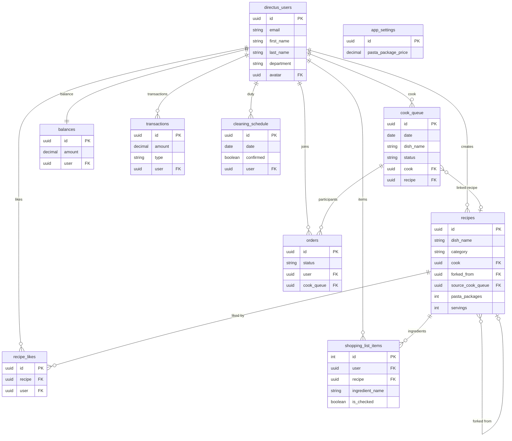

# ItoCook — Project State Overview

> Generated: 2026-06-18

---

## 1. Frontend File Structure (Nuxt 4 `app/` directory)

```
frontend/
  app/
    app.vue
    layouts/
      default.vue         — iPhone frame wrapper (Dynamic Island, BottomTabBar)
      app.vue              — auth-gated layout (Sidebar, participant modal)
    pages/
      onboarding.vue       — first-launch intro carousel
      auth.vue             — login / register
      index.vue            — Home: HeroBlock, BalanceWidget, DutyWidget, Recent Dishes
      kitchen.vue          — WeekCalendar, HeroBlock, Dish History, ShoppingListWidget
      cook.vue             — Cook Panel: 6-state machine, fork, receipt, deduction
      recipe/
        [id].vue           — Recipe detail: photo, steps, servings scaler, join, like
        create.vue         — Recipe create/edit: photo upload, ingredients, steps
      recipes.vue          — All Recipes: search, category filter, RecipeGridItem grid
      profile.vue          — My List (10h leave rule), My Recipes, Preferences, balance
      finance.vue          — Admin: all balances, top-up, transactions, pasta price
      duty.vue             — Duty roster: today card, MonthCalendar, admin edit mode
      shopping-list.vue    — By Recipe / All Items tabs, select-all, delete-checked
      ai-recipe.vue        — Placeholder (Phase 3)
      common.vue           — Placeholder (Phase 3)
    components/
      HeroBlock.vue        — "Who's cooking today?" hero (3 visual states)
      RecipeCard.vue       — Recipe list card (compact / full, like count)
      RecipeGridItem.vue   — Small grid card for recipes.vue
      BottomTabBar.vue     — 5-tab persistent nav (Finance tab conditional)
      BalanceWidget.vue    — Home widget: current balance with tiered coloring
      DutyWidget.vue       — Home widget: next duty assignment
      WeekCalendar.vue     — Horizontal 7-day scrollable calendar
      MonthCalendar.vue    — Full month grid (prev/next) for duty page
      ShoppingListWidget.vue — Kitchen sidebar: shopping list summary
      AddIngredientPopover.vue — Popover ingredient selector with category groups
      RecipeImageUpload.vue — Photo upload with preview and clear
      ReceiptSummary.vue   — Deduction preview: receipt + pasta cost split
      ActionBlockedModal.vue — Modal showing why an action is blocked (balance gate)
      AvatarPlaceholder.vue — User avatar fallback with initials
      BalanceRow.vue       — Finance page: single user balance row
      TransactionRow.vue   — Finance page: single transaction row
      SliderList.vue       — Horizontal scrollable recipe pill list
    composables/
      useDirectus.ts              — Core HTTP client (fetch, token, file upload)
      useAuth.ts                  — Auth lifecycle (login, signUp, logout, fetchUser)
      useDeduction.ts             — Deduction logic (confirm, pasta cost, shopping list cleanup)
      useParticipants.ts          — Meal participant state (join, leave, fetch)
      useParticipantsModal.ts     — Global participant list modal (module-level state)
      useBalanceCheck.ts          — Balance gate (check threshold before actions)
      useMealCost.ts              — Pasta cost calculation (fetches from app_settings)
      useRecipeImage.ts           — Category-based / uploaded image resolution
      useRecipeServings.ts        — Ingredient scaling by servings
      useLikes.ts                 — Recipe like/unlike with count caching
      useTotalUsers.ts            — Total user count for "X of Y confirmed"
    middleware/
      auth.global.ts              — Global auth guard (redirect to /auth)
      cook.ts                     — Cook panel guard (only today's cook)
    utils/
      dates.ts                    — Date formatting (formatDateISO, formatDateDE, etc.)
      dedupRecipes.ts             — Recipe dedup by dish_name (fork-aware)
      ingredientIcons.ts          — Ingredient → emoji lookup
      popularIngredients.ts       — Predefined ingredient list by category
      format.ts                   — formatUserName, formatCurrency
    assets/
      css/main.css                — Global styles (Jost font, scrollbar-hide)
  server/
    api/
      auth/signup.post.ts         — User registration proxy
      deduction/confirm.post.ts   — Meal deduction proxy
      duty/confirm.patch.ts       — Duty confirmation proxy
      duty/upsert.post.ts         — Duty upsert proxy
      settings/pasta-price.get.ts — Read pasta price proxy
      settings/pasta-price.patch.ts — Update pasta price proxy
      users/count.get.ts          — Total user count proxy
      users/list.get.ts           — All users list proxy
      users/update-me.patch.ts    — Update current user proxy
    utils/
      adminToken.ts               — Cached admin Bearer token
      auth.ts                     — verifyAccess helper for server routes
```

---

## 2. Frontend Pages Status

### ✅ Fully Working

| Page | Route | Notes |
|---|---|---|
| **Onboarding** | `/onboarding` | Flexible layout, TypeScript |
| **Auth** | `/auth` | Login/register, form validation, token in cookie, rate-limited signup |
| **Home** | `/` | HeroBlock, BalanceWidget, DutyWidget, Recent Dishes with likes |
| **Kitchen** | `/kitchen` | WeekCalendar, HeroBlock, Dish History search, ShoppingListWidget |
| **Cook Panel** | `/cook` | 6-state machine (assign→dish→scheduled→cooking→ready→done), cancel, fork, balance gate, receipt+deduction |
| **Recipe Detail** | `/recipe/[id]` | Photo, status badges, join, servings scaler (+ ingredient scaling), like, cook pill, steps display |
| **Recipe Create/Edit** | `/recipe/create` | Photo upload, AddIngredientPopover, prefill from history, fork-on-repeat |
| **All Recipes** | `/recipes` | Search + category filter, RecipeGridItem grid with likes, dedup |
| **Profile** | `/profile` | Avatar upload, My List (10h leave rule), My Recipes, Preferences sheet, balance+transactions |
| **Finance** | `/finance` | Admin only — all balances (tiered coloring), top-up form, transaction history, pasta price edit |
| **Duty** | `/duty` | Today's duty card, MonthCalendar (prev/next), admin edit/assign mode |
| **Shopping List** | `/shopping-list` | By Recipe / All Items tabs, select-all, delete checked, auto-cleanup on confirm/cancel |

### 🟡 Partial / Needs Polish

| Page | Missing |
|---|---|
| **Profile** | Statistics (times cooked, on duty), notification settings |
| **Kitchen** | Weekly menu, anonymous ratings |

### ⬜ Not Started

| Page | Route | What's needed |
|---|---|---|
| **AI Recipe** | `/ai-recipe` | Chat UI, JSON recipe render, "Add to recipes" |
| **Common** | `/common` | Announcements, pool collections, progress bars |

---

## 3. Directus Schema

### Custom Collections (9)

| Collection | Purpose | Key Fields | Relations | Policy |
|---|---|---|---|---|
| `recipes` | Main recipe catalog | `dish_name`(req), `category`, `ingredients`(JSON), `steps`(JSON), `photo`(file), `forked_from`(self), `pasta_packages`(int), `servings`(int) | cook→users, forked_from→recipes(self), source_cook_queue→cook_queue | Create own, Read all, Update own, Delete own |
| `cook_queue` | Scheduled cooking sessions | `date`, `dish_name`, `status`(scheduled/cooking/ready/cancelled), `category`, `recipe`(M2O) | cook→users, recipe→recipes | Create own, Read all, Update own, Delete own |
| `orders` | Meal participation | `status`(pending/confirmed/cancelled/completed), `user`, `cook_queue` | user→users, cook_queue→cook_queue | Create own, Read own, Update own, Delete own |
| `balances` | Per-user account | `amount`(decimal), `user`(unique) | user→users | Read own, Update(admin proxy) |
| `transactions` | Financial records | `amount`(decimal), `type`(debit/credit), `description`, `date`, `user` | user→users | Create(admin proxy), Read own, Delete own |
| `recipe_likes` | Recipe likes junction | `recipe`(req), `user`(req) | recipe→recipes(CASCADE), user→users(CASCADE) | Create own, Read all, Delete own |
| `shopping_list_items` | Shopping list | `ingredient_name`(req), `amount`, `unit`, `emoji`, `is_checked`, `sort`, `cook_date`, `recipe_name` | user→users, recipe→recipes | Create own, Read own, Update own(is_checked,sort), Delete own |
| `cleaning_schedule` | Duty roster | `date`(req), `user`(req), `department`(req), `confirmed`(bool) | user→users | Read all, Update own(confirmed only) |
| `app_settings` | Global singleton | `pasta_package_price`(decimal, default 1.00) | — | Read all, Update(admin proxy) |


### System Collections in Use

| Collection | Usage |
|---|---|
| `directus_users` | User accounts; custom fields: `department`(string), `avatar`(M2O→files) |
| `directus_files` | Uploaded photos (recipe images, avatars) |
| `directus_folders` | `recipe-photos` folder |

---

## 4. Directus Relations Diagram

```
directus_users
  ├── cook_queue.cook          (M2O: one user → many queue entries)
  ├── orders.user              (M2O: one user → many orders)
  ├── balances.user            (M2O: one user → one balance)
  ├── transactions.user        (M2O: one user → many transactions)
  ├── recipes.cook             (M2O: one user → many recipes)
  ├── recipe_likes.user        (M2O: one user → many likes)
  ├── shopping_list_items.user (M2O: one user → many items)
  ├── cleaning_schedule.user   (M2O: one user → many duty entries)
  └── directus_users.avatar    (M2O→directus_files)

recipes
  ├── forked_from              (M2O→recipes self-ref: original recipe)
  ├── source_cook_queue        (M2O→cook_queue: origin queue entry)
  ├── cook_queue.recipe        (M2O←cook_queue: linked fork)
  ├── recipe_likes.recipe      (M2O←recipe_likes: likes for this recipe, CASCADE)
  └── shopping_list_items.recipe (M2O←shopping_list_items: items for this recipe)

cook_queue
  └── orders.cook_queue        (M2O←orders: all orders for this queue entry)
```

---




## 4.1 Directus Relations Diagram


---

## 5. Data Flow Summary

### "Become Cook" Flow
1. **Balance Gate check** — `useBalanceCheck.check()` prevents cook assignment if balance < -30 €
2. `POST /items/cook_queue` — create entry with `cook`=current user, `status`=scheduled
3. `POST /items/orders` — auto-create `confirmed` order for the cook
4. Later: `PATCH /items/cook_queue/{id}` → status=cooking → status=ready
5. (Optional from recipe detail) `POST /items/orders` — other users join (also balance-gated)

### "Save Dish" Flow (Cook Panel)
1. `PATCH /items/cook_queue/{id}` — set `dish_name`, `category`, `status=scheduled`
2. If matching recipe exists by `dish_name`:
   - If user owns it: link directly
   - If another user owns it: fork (create copy with `forked_from`=original)
3. `PATCH /items/cook_queue/{id}` — link `recipe` to the (forked) recipe
4. On repeat cooking: reuse existing fork instead of creating another copy

### "Confirm Deduction" Flow (admin-proxy)
1. Frontend → Nuxt server route `POST /api/deduction/confirm`
2. Server obtains admin token via `getAdminToken()`
3. Fetch participants via `GET /items/orders?filter[cook_queue][_eq]`
4. Fetch pasta cost from `app_settings` (via `useMealCost`)
5. `POST /items/transactions` — one per participant with `amount`=-share
6. `PATCH /items/balances` — deduct each participant's share
7. `PATCH /items/cook_queue/{id}` → status=completed
8. `DELETE /items/shopping_list_items` — cleanup linked items

### "Cancel Cooking" Flow
1. `PATCH /items/cook_queue/{id}` → status=cancelled
2. `GET /items/orders` → `DELETE /items/orders/{id}` each
3. `DELETE /items/shopping_list_items` — cleanup linked items

### Signup Flow (admin-proxy)
1. Frontend → Nuxt server route `POST /api/auth/signup`
2. Server validates: email format, password strength (8+ chars, upper+lower+digit), name length
3. IP-based rate limit: max 5 requests / 60s sliding window
4. Server obtains admin token via `getAdminToken()`
5. `POST /users` — Directus Admin API creates user with User role
6. Returns `{ success: true }` or forwards Directus error

### Fork-on-Cook Flow
1. User B cooks User A's recipe
2. `POST /items/recipes` — create copy with `forked_from`=A's recipe, `cook`=B
3. `PATCH /items/cook_queue/{id}` — link `recipe` to the new fork
4. `dedupRecipes` shows only the latest fork per `dish_name` in recipe lists

### Shopping List Flow
1. From recipe detail: `POST /items/shopping_list_items` — one per scaled ingredient
2. Auto-deleted on `confirmDeduction` or `cancelCooking`
3. `is_checked` toggled via `PATCH` in shopping list UI

---

## 6. Composables Overview

| Composable | Purpose | Key Notes |
|---|---|---|
| `useDirectus` | Core HTTP client | Wraps fetch, auto-attaches Bearer token, handles Directus `{ data }` unwrap, 204 empty-body |
| `useAuth` | Auth lifecycle | login, signUp, logout, fetchUser, isTodayCook; stores user in `useState('auth:user')` |
| `useDeduction` | Meal deduction | confirmDeduction, loadPastaCost, cleanupShoppingList; returns plain object — needs `reactive()` |
| `useParticipants` | Participant CRUD | join, fetch, hasJoined, confirmed count; returns plain object — needs `reactive()` |
| `useParticipantsModal` | Modal state | Module-level refs, opened from any page via HeroBlock `@show-participants` |
| `useBalanceCheck` | Balance gate | check() returns boolean; MIN_BALANCE=-30; safe fallback on API error |
| `useMealCost` | Pasta cost | fetchPastaPrice (admin-proxy), computePastaCost (pure); cached price ref |
| `useRecipeImage` | Image resolution | category-based fallback vs uploaded Directus asset; used by 4 components |
| `useRecipeServings` | Servings scaling | Scales ingredient amounts by serving ratio |
| `useLikes` | Likes | Like/unlike, countMap caching, batch fetch |
| `useTotalUsers` | User count | Total WG members for "X of Y confirmed" |

---

## 7. Architecture & Documentation

| File | Contents |
|---|---|
| `docs/ARCHITECTURE.md` | Design decisions per file — 11 sections (Core, Auth, Cook Panel, Deduction, Participants, Balance Gate, Meal Cost, Signup Proxy, Admin Token, Cook Guard, Dedup, Ingredient Icons, HeroBlock) |
| `docs/CONTEXT.md` | Domain glossary — 30+ terms with file refs, collection names, related concepts |
| `docs/design.md` | Design system — color tokens, spacing, typography, component specs |
| `docs/roadmap.md` | High-level phases (Phase 1-3), milestones per phase |
| `docs/progress.md` | Daily progress log, current status, known issues, git log |
| `docs/plan-main.md` | Master implementation plan |
| `docs/audits/refactoring-plan.md` | Refactoring roadmap and patterns |

  | `docs/audits/security-audit.md` | Security audit findings and fixes |
---

## 8. Security Measures

| Measure | Status | Details |
|---|---|---|
| Admin token caching | ✅ | 23h TTL, in-memory, resets on restart |
| Signup rate limit | ✅ | 5 req / 60s per IP, in-memory sliding window |
| Signup validation | ✅ | Email regex, password strength (8+ chars, upper+lower+digit), name length |
| Balance check gate | ✅ | -30 € threshold checked before cook/join actions |
| Admin proxy pattern | ✅ | All privileged operations go through Nuxt server routes — admin credentials never exposed to client |
| Route protection | ✅ | Global auth middleware; cook-only guard on `/cook` |
| Password in env | ✅ | Directus admin credentials in `.env`, not in code |
| CORS | ✅ | Directus CORS configured for frontend origin only |

---

## 9. Build & Tech Stack

| Layer | Technology |
|---|---|
| Frontend | Nuxt 4 / Vue 3 / TypeScript / Tailwind CSS v4 |
| Icons | @phosphor-icons/vue (Ph prefix) |
| UI Framework | Nuxt UI (minimal usage) |
| Backend CMS | Directus 11.17 (Docker, PostgreSQL 15) |
| Auth | Directus JWT (email/password, 7d TTL) |
| Hosting | Local Docker (frontend:3000, directus:8055) |
| Code Style | TypeScript strict mode, PEP8 (Python), PSR-12 (PHP) |
| Commits | Conventional commits (feat:, fix:, chore:, docs:) |
